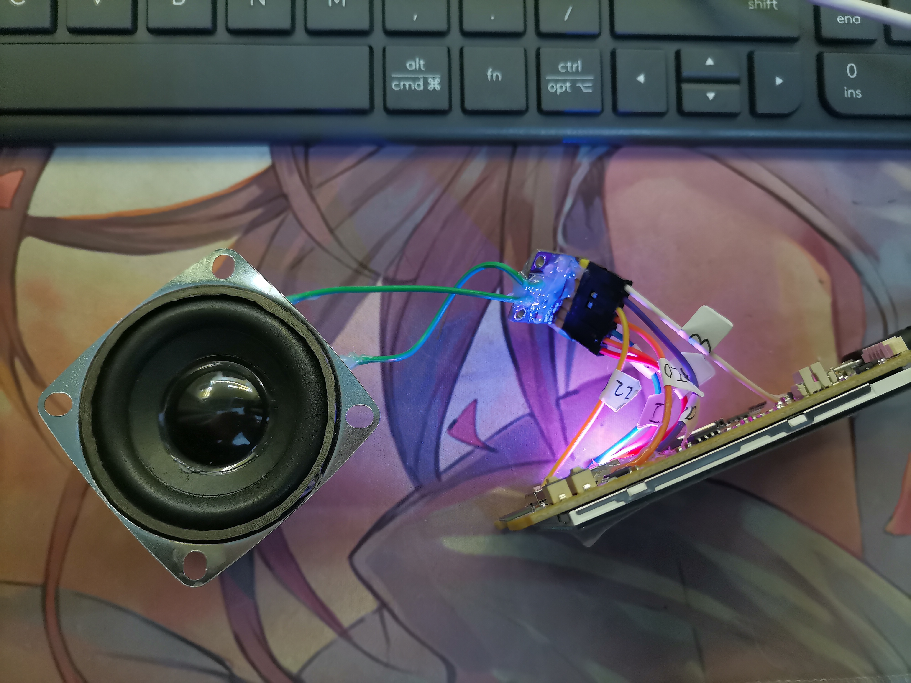
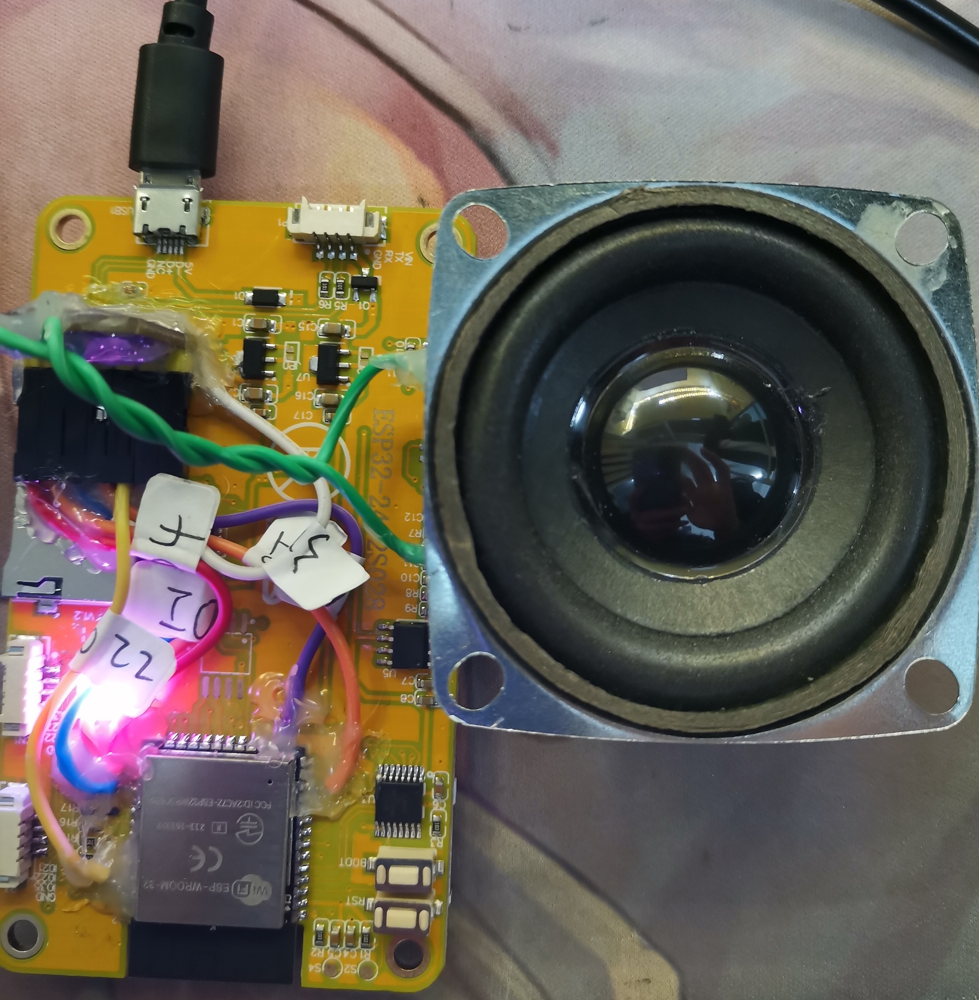
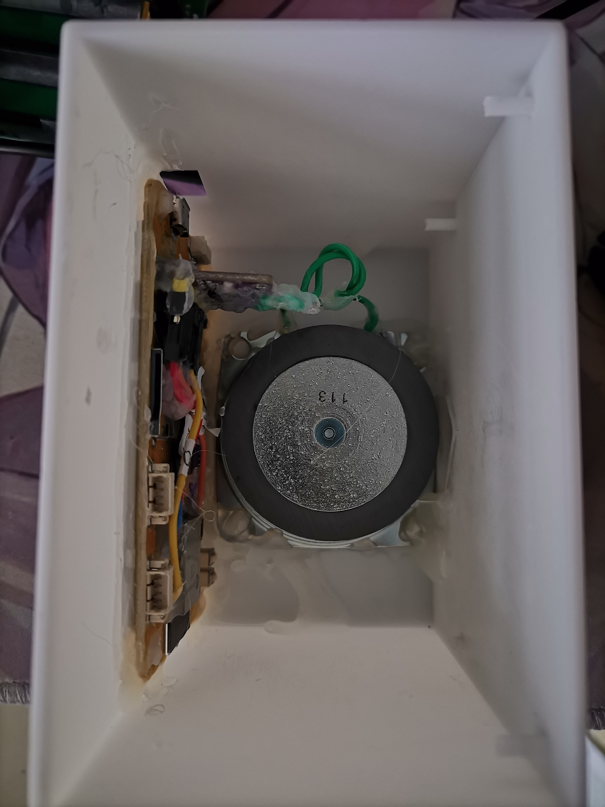
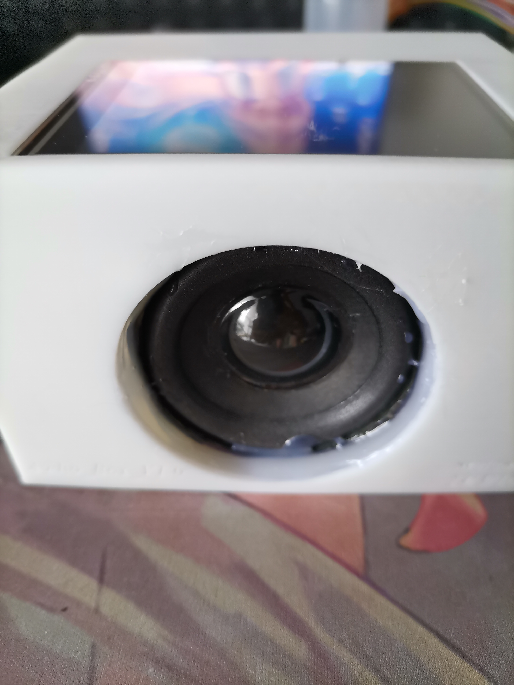
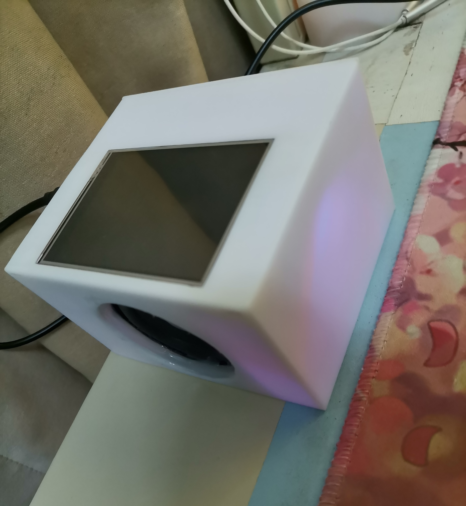

<!--
 * @Author: meteor
 * @Date: 2024-08-01
 * @LastEditTime: 2024-08-02
 * @Description: 
 * 
 * Copyright (c) 2024
-->
# Bluetooth Audio Box

本项目就是拿一些吃灰的板子、模块拼凑而成(doge
>下面是一些相关说明：

- [0.硬件组成](#header0)
- [1.支持功能](#header1)
- [2.部分bug](#header2)
- [3.成品图](#header3)


## <span id="header0">0.硬件组成</span>
主要部分包含：
- [包含一个LCD的ESP32开发板](misc/ESP32-2432S028%20Specifications-EN.pdf)
- [MAX98357 D类音频放大器模块](https://item.taobao.com/item.htm?spm=a21n57.1.item.4.41c0523cNI2clv&priceTId=215043f717225234279657486e62c9&utparam=%7B%22aplus_abtest%22:%22fb47fd1f55ebef5b32063dceec7dc59d%22%7D&id=608192660156&ns=1&abbucket=12&pisk=f7nK9maxSCAnkqYoAvTgq2lD7cviyDHetXkfq7VhPfhtF5jkLkYz2bFtaW43AWj82YhrZbHyL8NSNbFo-FxmLvrzVIcJmnDE6AIOCXU7OR97F8NWvhYMdvrzVQBGVExxLjde6pOLPdE_e8s7Vw_Cfde8e6Z7Oz115-N_NuZSNPt_E875VyaC1AGm3MFRdSS-P0u6miJRVgI-XRNUGvp54RigpHNxK5eagcI4JSMQ6gOccXO_w5oXsFHZN2G3QbKv6ogq60Ub2HC4pVMYfWqXkNEKIXoYAmddxR489ViQWTsSHvN_r4hp9wPI-fU4CP6J0Rc01voIWL5sdjVLARaMcKH_PVmUuDA1vogqKk0SGCb3Oqe54gomDdaViSelRdpOzazQIrq34MwB2N0bBSvZ_a7zWRyTidpOzazQQRFDQf7PzPeN.&skuId=4840166639405)
- [2寸、4欧、3W全频喇叭](https://detail.tmall.com/item.htm?id=622079463126&spm=a1z09.2.0.0.61312e8djpQNa5&_u=12096rm1jp403b&pisk=fdvImpsXby4BntK1r6nN13M7JiWWFeMqeusJm3eU29BdN8KelgyPaXj7FNtxxwlotUO6yFfFJa5PFgTVSHyrxHoSF3KAJTRF8gLwPFVe8L7y7YtDl6ye2LrHsE-YLplhU86hET3quxk4xHXlevGvE0a3BgsKUJe8eWM6YcuquxkS9lBSRqRyWxwG5g_OvgCL9c1OVMBRvWIKfNI5m7UpyTn6XNjzJzFLpOKOmgV-T9c1XX_wAceZoDXtb_-d5-ZDKMKatH7s9X9_36_YuNw8edsBjNHDf-GPkIbFgaTtQJ6WXgT1gBgbdUtJmQC6FynekFdWyGAiP7_XwHRDw1iKph6CR1IC9oPGdQLHF6AQqmxOpFAco6hiSG9e3__c1P3pbh_dGQTES8QeGhL1gdza3tdD5L1AHgyL3ZaVz7Z1i8s1uci_Z7SlZY46hXxb-6IGjoosfSPl9Gj1uci_Z7fdjGqqfcN4Z)


## <span id="header1">1.支持功能</span>
- 控制歌曲播放/暂停;
- 通过AVRCP来获取歌曲信息，包括标题(Title)、歌手(Artist)、专辑(Album)、歌曲总时长(Total Time)，并显示到屏幕上;
- 音量调节;
- 上电自动连接蓝牙(上一次配对的设备);
- N(Normal)和H(High)双模式切换;


## <span id="header2">2.部分bug</span>
1. 当使用H模式(High)时，声音过大会有明显失真，虽然说这是数字音频难以避免的，但是硬件本身也不太行，音频都靠乱七八糟的线连起来的...
2. 不支持电池供电，这也是本项目的一大败笔...后续有空可能会优化一下，做个新的;
3. 连上手机蓝牙后，必须要手机先播放一下之后，才能自由控制播放/暂停，目前不知道是什么原因...然而上一曲/下一曲却随时都能够控制;
4. 字体使用的是[楷体](misc/楷体.ttf)，大小为16像素，使用了LVGL官方的[```Font Converter```](https://lvgl.io/tools/fontconverter)来进行字体转换，字体使用了Unicode的**0x4E00**到**0x9FFF**区间的基本中文编码，目前**仅支持基本中英文显示**。


## <span id="header3">3.成品图</span>
> 成品图如下








# Acknowledgement
非常感谢下列库的作者，给本项目提供方便快捷的库：
> - [pschatzmann/ESP32-A2DP](https://github.com/pschatzmann/ESP32-A2DP)
> - [lovyan03/LovyanGFX](https://github.com/lovyan03/LovyanGFX)
